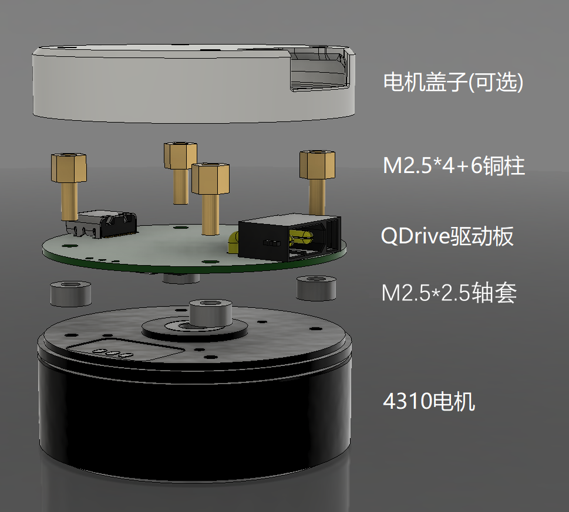

 # QDrive-硬件部分
 
 - 软件部分参见： [QDrive-软件部分](https://github.com/Liu-Curiousity/QDrive-Software)

 ## 如何使用

1. **制板**：

   - 从[Release](https://github.com/Liu-Curiousity/QDrive-Hardware/releases)页面下载制版文件(gerber)即可发给板厂生产。
   - 如果你恰好财力雄厚，可以一并下载BOM表和贴片坐标文件，让板厂直接帮你贴片。
   - 自己贴片的话，由于元器件排布紧凑，没有留下元件编号丝印，要麻烦你对照着源文件贴片啦。

2. **组装**：

   - 电机使用的是GB4310/PM4310电机，请自行购买，购买时选择裸电机即可，本驱动板自带编码器。
   - 按照下图所示装配：
   - 
